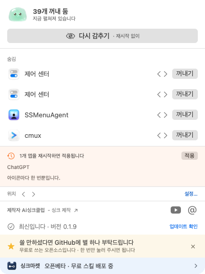
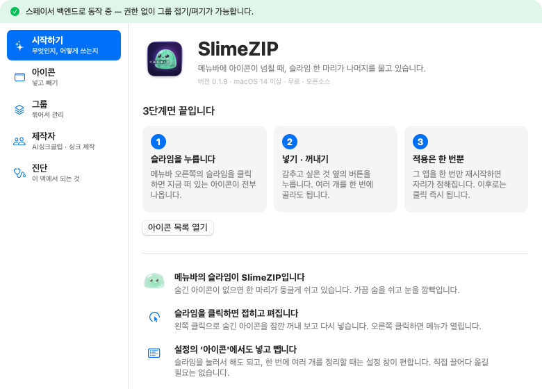
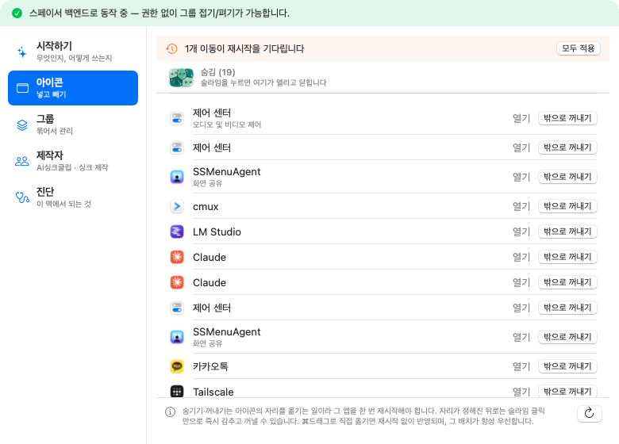
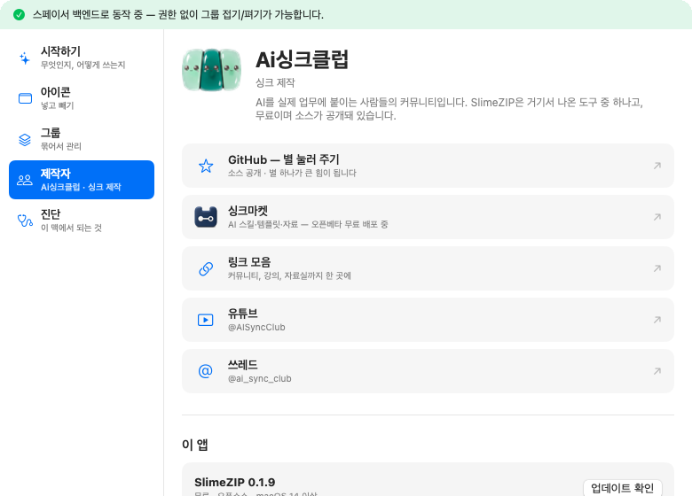
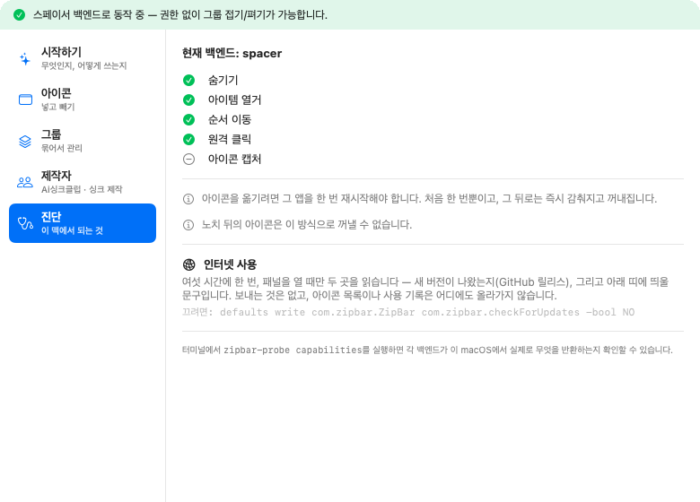

<div align="center">


# SlimeZIP

### 아이콘 찾으려고 메뉴바 훑지 마세요

맥 메뉴바 아이콘을 **슬라임 하나가 물어서** 정리해 줍니다.
필요한 것만 남기고, 나머지는 클릭 한 번으로 꺼냈다 넣었다 합니다.

<br>

**한국어** · [English](README.en.md) · [日本語](README.ja.md) · [简体中文](README.zh.md)

[**설치하기**](docs/INSTALL.md) · [소개 페이지](https://aisyncclub.github.io/slimezip/) · [최신 릴리스](https://github.com/aisyncclub/slimezip/releases/latest) · [문제 해결](docs/INSTALL.md#4-문제가-생기면)

[](https://github.com/aisyncclub/slimezip/stargazers)
[](docs/INSTALL.md)
[](#라이선스)

**무료로 쓰셨다면 별 하나 부탁드립니다.** 만드는 사람에게는 그게 전부입니다.

</div>

> [!TIP]
> **영어 화면도 있습니다.** 처음 켤 때 시스템 언어를 따르고, 직접 고르려면
> **슬라임 우클릭 → 설정 → 제작자 → 이 앱 → 언어**에서 `한국어` / `English` /
> `시스템 설정 따름` 중에 고르시면 됩니다. 바꾸면 바로 반영되고 재시작은 필요 없습니다.

<br>


<br>

## 목차

| | |
|---|---|
| [무엇이 문제인가](#무엇이-문제인가) | 아이콘이 스무 개를 넘어가면 생기는 일 |
| [어떻게 생겼나](#어떻게-생겼나) | 실제 화면 |
| [무엇을 하나](#무엇을-하나) | 기능 |
| [설치](#설치) | 1분 |
| [어떻게 쓰나](#어떻게-쓰나) | 매일 하는 일과 한 번만 하는 일 |
| [설정 화면](#설정-화면) | 네 개의 항목 |
| [어떻게 동작하나](#어떻게-동작하나) | 측정한 값과 방식 |
| [개인정보 · 네트워크](#개인정보--네트워크) | 무엇을 읽고 무엇을 안 보내는가 |
| [개발](#개발) | 빌드 · 테스트 · 진단 |

---

## 무엇이 문제인가

맥북·맥 스튜디오·맥 미니에서 아이콘이 스무 개를 넘어가면 세 가지가 동시에 일어납니다.

| | |
|---|---|
| **넘치면 그냥 사라집니다** | 경고도 표시도 없이 왼쪽부터 잘려 나갑니다. 노치가 있으면 더 빨리 없어집니다. |
| **어느 앱 것인지 모릅니다** | macOS 26부터 제어 센터가 아이콘을 대신 그려서, 창만 봐서는 주인을 알 수 없습니다. |
| **옮기려면 ⌘드래그뿐** | 하나씩 끌어서 옮기고, 어디에 뒀는지 다시 잊습니다. |

---

## 어떻게 생겼나

<table>
<tr>
<td width="42%" valign="top">



</td>
<td valign="top">

### 슬라임을 누르면 열리는 패널

지금 메뉴바에 떠 있는 아이콘이 **앱 이름과 함께** 전부 나옵니다.

- 맨 위 파란 버튼 — **꺼내 보기 / 다시 감추기**. 재시작 없이 즉시.
- 각 줄의 `‹ ›` — 순서 바꾸기
- 각 줄의 **넣기 · 꺼내기** — 숨김 그룹 안팎으로 옮기기
- 주황 띠 — 적용을 기다리는 앱과 그 개수
- 맨 아래 — 버전 · 업데이트 확인 · 제작자 · 배너

</td>
</tr>
</table>

<table>
<tr>
<td valign="top">



**시작하기** — 처음 열면 여기입니다. 3단계 사용법과 튜토리얼.

</td>
<td valign="top">



**아이콘** — 한 번에 여러 개를 정리할 때 편한 넓은 목록.

</td>
</tr>
<tr>
<td valign="top">



**제작자** — Ai싱크클럽 링크와 이 앱의 버전·업데이트.

</td>
<td valign="top">



**진단** — 이 맥에서 무엇이 되고 무엇이 안 되는지.

</td>
</tr>
</table>

---

## 무엇을 하나

### 눌린 슬라임 — 폭은 22pt 고정


숨긴 개수가 늘어도 **아이콘 폭은 변하지 않습니다.** 숫자를 붙이면 자리를 더 먹으니,
대신 슬라임들이 같은 자리에서 서로를 눌러 찌부됩니다. 눈도 깜빡이고 가끔 숨도 쉽니다.

### 나머지

| | |
|---|---|
| **이름으로 식별** | 접근성 권한으로 각 앱이 게시한 정보를 읽어, Tailscale인지 카카오톡인지 이름으로 보여 줍니다. 이 맥에서 43개 중 35개를 이름까지 식별했습니다. |
| **클릭 한 번으로 넣고 빼기** | ⌘드래그로 씨름할 필요가 없습니다. 버튼으로 합니다. |
| **순서 바꾸기** | `‹ ›`로 좌우로 옮깁니다. |
| **SlimeZIP 자기 위치도 이동** | 패널의 "위치 `‹ ›`". 이건 우리 아이템이라 재시작도 필요 없습니다. |
| **숨긴 사이 변화 알림** | 감춰 둔 아이콘이 바뀌면 슬라임이 움찔하고 주황 점이 찍힙니다. |
| **그룹** | 여러 그룹을 만들어 따로 접고 펼 수 있습니다. "항상 숨김" 그룹은 일반 클릭으로 열리지 않습니다. |
| **자동 업데이트 확인** | 새 버전이 나오면 패널에 뜨고, 버튼 한 번으로 받아서 스스로 교체합니다. |
| **한국어 · English** | 시스템 언어를 따르고, 설정 → 제작자 → 이 앱 → 언어에서 직접 고를 수도 있습니다. 바꾸면 즉시 반영됩니다. |
| **쉬는 동안 CPU 0.0%** | 폴링하지 않습니다. |

---

## 설치

### 내려받아서

1. [릴리스](https://github.com/aisyncclub/slimezip/releases/latest)에서 `SlimeZIP-*.dmg`를 받습니다
2. 두 번 눌러 열고, 슬라임을 오른쪽 **응용 프로그램**으로 끌어다 놓습니다
3. 처음 열면 macOS가 막습니다 → **시스템 설정 → 개인정보 보호 및 보안** 맨 아래 **확인 없이 열기**
4. **시스템 설정 → 손쉬운 사용**에서 SlimeZIP을 켭니다

> **우클릭 → 열기는 macOS 세쿼이아부터 안 됩니다.** 3번의 시스템 설정 경로가 유일합니다.
> 인터넷의 오래된 안내가 우클릭을 말하고 있다면 그건 세쿼이아 이전 이야기입니다.

### 터미널이 익숙하면

```bash
curl -fsSL https://aisyncclub.github.io/slimezip/install.sh | bash
```

3번을 건너뛰게 해 주는 것뿐, 하는 일은 같습니다.
[스크립트를 먼저 읽어 보셔도 됩니다](scripts/install.sh).

**화면 그림까지 있는 단계별 안내와 문제 해결은 [설치 가이드](docs/INSTALL.md)에 있습니다.**

---

## 어떻게 쓰나

두 가지 동작이 있고, **매일 쓰는 쪽은 재시작이 필요 없습니다.**

| 동작 | 재시작 | 언제 |
|---|---|---|
| 패널 맨 위 **꺼내 보기 / 다시 감추기** | **없음** | 매일 |
| 각 줄의 **넣기 · 꺼내기** | 그 앱 1회 | 자리 정할 때만 |

파란 버튼은 구분자 길이만 늘였다 줄입니다. 저장된 위치를 건드리지 않으니 즉시 됩니다.

줄의 넣기·꺼내기는 아이콘을 경계 너머로 **아예 옮기는** 것이라 macOS에 저장된 위치를
다시 씁니다. macOS는 그 값을 **앱이 시작할 때만** 읽기 때문에 그 앱을 한 번 재시작해야
합니다. 한 앱에 아이콘이 여럿이어도 재시작은 한 번입니다.

### 조작 정리

| | |
|---|---|
| **클릭** | 패널 열기 |
| **⌥ + 클릭** | 접기 ↔ 펴기 바로 전환 |
| **우클릭** | 설정 · 종료 메뉴 |

### 제어 센터 아이콘은 예외입니다

와이파이·배터리·소리·블루투스는 macOS 26부터 **제어 센터가 그립니다.** 위치를 쓰는 것까지는
되지만, 메뉴바 절반을 그리는 프로세스를 아이콘 하나 때문에 끄지는 않습니다.
그런 항목은 재시작 대신 **"다음 로그인에 적용"** 으로 표시됩니다.

---

## 설정 화면

우클릭 → **설정**. 왼쪽 사이드바에 네 개가 있습니다.

| | |
|---|---|
| **시작하기** | 앱 소개, 3단계 사용법, 튜토리얼, 아직 안 되는 것 |
| **아이콘** | 넓은 목록에서 한 번에 여러 개 정리 |
| **그룹** | 그룹 추가·이름·동작 방식 |
| **제작자** | Ai싱크클럽 링크, 이 앱의 버전과 업데이트 |

---

## 어떻게 동작하나

macOS가 이 영역을 두 번 연속 깨뜨렸습니다. macOS 26 Tahoe가 윈도우 소유자 정보를
오염시켰고, macOS 27 Golden Gate가 메뉴바 구조를 통째로 바꿔
Bartender · Ice · Barbee · Thaw · BetterTouchTool이 전부 동작 불능이 됐습니다.
측정 근거는 [docs/RESEARCH.md](docs/RESEARCH.md)에 있습니다.

그래서 설계 원칙은 **런타임 능력 탐지**입니다. 기능을 하드코딩하지 않고 OS에 물어본 뒤
되는 것만 UI에 노출합니다. 안 되면 조용히 실패하는 대신 배너로 말합니다.

```
UI  ────────────────────────  Capabilities에 따라 기능을 켜고 끔
MenuBarEngine  ─────────────  그룹·순서·상태의 단일 진실
HidingStrategy (프로토콜) ──  ★ OS가 바뀌어도 여기까지만 다시 씀
  └ SpacerStrategy           길이 팽창 · 권한 0개 · macOS 14–26
  └ (Phase 2) BridgeStrategy 열거 · 이동 · 원격 클릭
```

### 숨기기의 원리

그룹마다 보이지 않는 **구분자** 하나를 메뉴바에 둡니다. 접을 때 그 구분자의 길이를
화면 폭의 두 배로 부풀리면, 구분자보다 **왼쪽에 있는 아이콘이 전부 화면 밖으로**
밀려납니다. 펼 때는 다시 1pt로 줄입니다. 권한도, 비공개 API도 필요 없습니다.

그래서 "숨긴다"는 건 **구분자 왼쪽에 둔다**는 뜻이고, 아이콘을 그쪽으로 옮기는 것이
위치를 다시 쓰는 유일한 순간입니다.

### 측정한 값

전부 이 맥(맥 스튜디오, macOS 26.5)에서 직접 재서 기록한 것입니다.

| | |
|---|---|
| **43개** | 접근성 스윕으로 열거된 메뉴바 아이템 |
| **35개** | 앱 이름까지 식별한 아이콘 |
| **22pt** | 몇 개를 물든 변하지 않는 아이콘 폭 |
| **0.0%** | 쉬는 동안 CPU 사용률 |

macOS가 무엇을 허용하고 무엇을 막는지도 측정했습니다.

| | |
|---|---|
| 열거 · 식별 | ✅ 접근성 스윕으로 가능 |
| 숨기기 | ✅ 구분자 길이 팽창으로 가능 |
| 원격 클릭 | ✅ `AXPress`로 가능 |
| 접근성으로 위치 쓰기 | ❌ 34개 중 0개 성공 |
| 합성 ⌘드래그 | ❌ 0pt 이동 |
| 저장된 위치 쓰기 + 대상 앱 재시작 | ✅ 가능 (461 → 792 확인) |

마지막 줄이 지금 방식입니다.

### 아직 안 되는 것

- 노치 뒤에 가려진 아이콘은 이 방식으로 꺼낼 수 없습니다
- 화면 기록 아이콘처럼 시스템이 우선하는 항목은 숨길 수 없습니다
- 숨겨진 앱의 **알림 개수**는 알 수 없습니다. macOS가 다른 앱의 미읽음 상태를
  공개하지 않아서, 대신 아이콘 그림이 바뀌면 슬라임이 움찔합니다

---

## 개인정보 · 네트워크

**여섯 시간에 한 번, 그것도 패널을 열 때만 두 곳을 읽습니다.**

| 무엇을 | 어디서 |
|---|---|
| 새 버전이 나왔는지 | `api.github.com/repos/aisyncclub/slimezip` |
| 아래 띠에 띄울 문구 | [`app-config.json`](web/app-config.json) (이 저장소의 GitHub Pages) |

**보내는 것은 없습니다.** 아이콘 목록도, 사용 기록도, 식별자도 어디에도 올라가지 않습니다.
접근성 권한은 **읽기에만** 씁니다 — 키 입력을 가로채거나 기록하지 않습니다.
[소스](Sources/ZipBarKit/Services)에서 확인하실 수 있습니다.

끄려면:

```bash
defaults write com.zipbar.ZipBar com.zipbar.checkForUpdates -bool NO
```

버튼으로 직접 누르는 "업데이트 확인"은 이 설정과 무관하게 동작합니다. 묻지 않았는데
연락받기 싫은 것과, 물었을 때 답을 듣는 것은 다른 이야기입니다.

---

## 개발

Xcode는 필요 없습니다. Command Line Tools만으로 빌드됩니다.

```bash
swift build && swift test     # 빌드 + 테스트 (113개)
./scripts/build-app.sh        # dist/SlimeZIP.app 만들기
./scripts/release.sh v0.2.0   # 버전 기록 + 빌드 + 압축 + GitHub 릴리스
```

### 진단

OS 업데이트 후 무엇이 깨졌는지 확인합니다. **베타가 나오면 가장 먼저 돌립니다.**

```bash
./.build/debug/zipbar-probe capabilities   # 각 백엔드가 되는지 요약
./.build/debug/zipbar-probe list           # 열거 결과 전체
./.build/debug/zipbar-probe ax             # 접근성 스윕 상세 (권한 필요)
```

UI는 주장하지 않고 그려서 확인합니다. 아래 환경 변수로 실행하면 실제 뷰 계층을
PNG로 씁니다 — 화면 기록 권한도, 사람이 앉아 있을 필요도 없습니다.

```bash
ZIPBAR_PROBE_PANEL_SHOT=1     ZIPBAR_PANEL_OUT=/tmp/panel.png      # 패널
ZIPBAR_PROBE_SETTINGS_SHOT=1  ZIPBAR_SETTINGS_TAB=creator          # 설정 (탭 선택)
ZIPBAR_PROBE_UPDATE=1                                              # 업데이트 전 과정
```

이 README의 화면 그림도 전부 이걸로 찍었습니다.

### 배포 제약

접근성 권한을 쓰므로 **샌드박스가 불가능하고 Mac App Store에 올릴 수 없습니다.**
직접 배포가 유일한 경로입니다.

아직 애플 공증(notarization)을 받지 않았습니다 — 연 $99짜리 Developer ID가 필요합니다.
그래서 처음 열 때 시스템 설정을 한 번 거쳐야 합니다. 공증을 받으면 그 단계가 없어지고
Homebrew cask 등록도 열립니다.

### 기여

버그 제보와 PR 환영합니다. [이슈](https://github.com/aisyncclub/slimezip/issues)에
**무엇을 하려다 어디서 멈췄는지, macOS 버전과 함께** 적어 주시면 빠릅니다.

---

## 라이선스

무료이며 소스가 공개돼 있습니다.

`Ice`는 GPL-3.0입니다. 향후 라이선스 유연성을 위해 **Ice 소스는 읽지도 참조하지도
않습니다.** 동작만 관찰합니다.

---

<div align="center">

**여기까지 읽으셨다면, 별 하나 부탁드립니다.** ⭐

[](https://github.com/aisyncclub/slimezip/stargazers)

<sub>SlimeZIP · Ai싱크클럽 · 싱크 제작 · macOS 14+ · 무료 · 오픈소스</sub>

</div>
