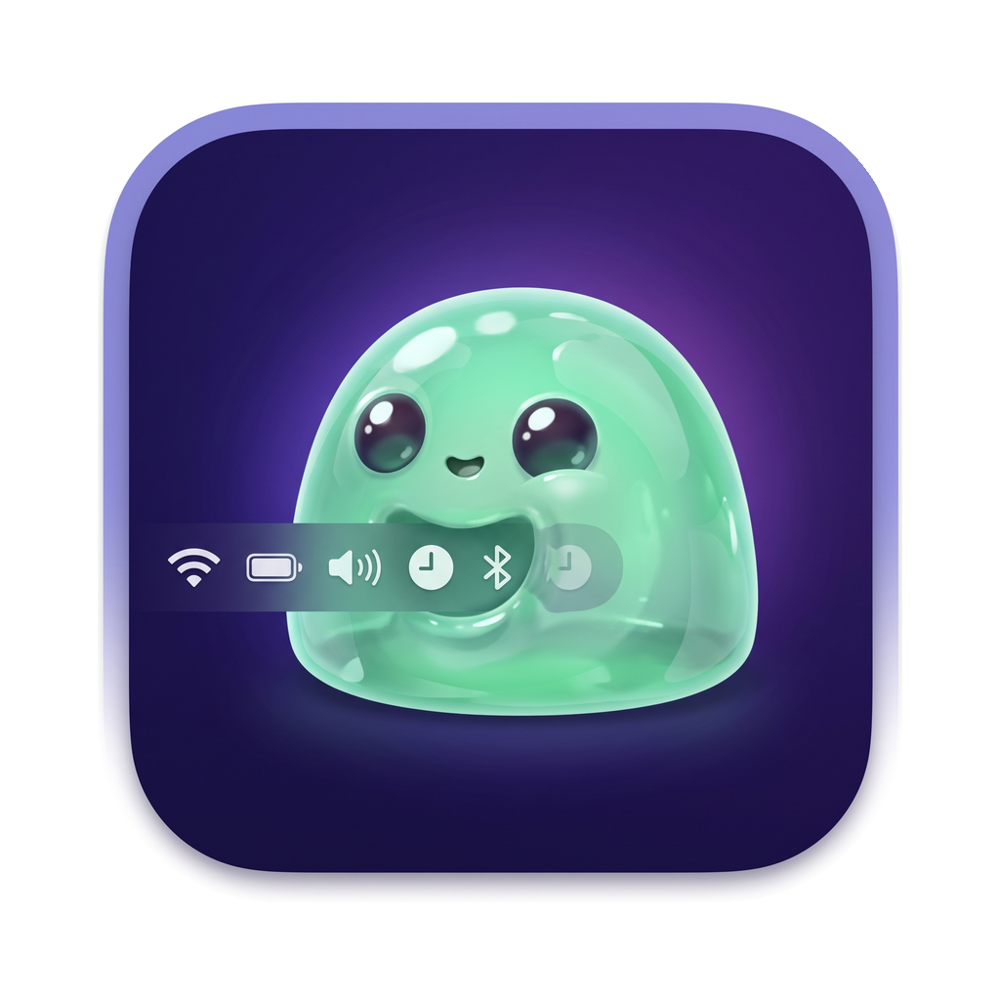
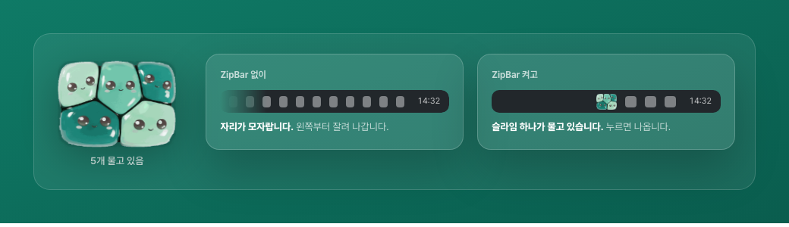
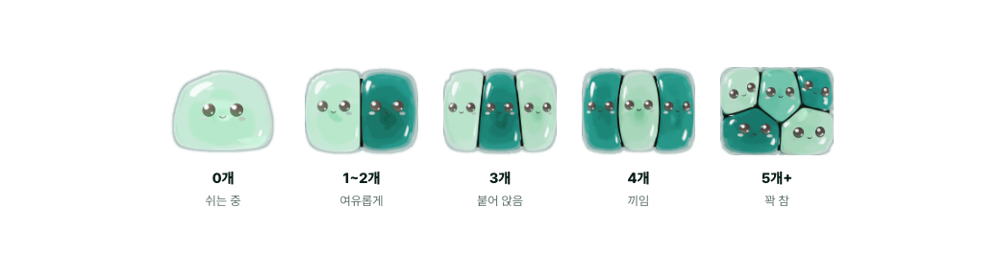

<div align="center">



# ZipBar

### 아이콘 찾으려고 메뉴바 훑지 마세요

맥 메뉴바 아이콘을 **슬라임 하나가 물어서** 정리해 줍니다.
필요한 것만 남기고, 나머지는 클릭 한 번으로 꺼냈다 넣었다 합니다.

<br>

[**설치하기**](docs/INSTALL.md) · [최신 릴리스](https://github.com/aisyncclub/zipbar/releases/latest) · [문제 해결](docs/INSTALL.md#4-문제가-생기면)

<sub>macOS 14 이상 · 무료 · 오픈소스 · 설치 1분</sub>

</div>

<br>



<br>

## 무엇이 문제인가

맥북·맥 스튜디오·맥 미니에서 아이콘이 스무 개를 넘어가면 세 가지가 동시에 일어납니다.

| | |
|---|---|
| **넘치면 그냥 사라집니다** | 경고도 표시도 없이 왼쪽부터 잘려 나갑니다. 노치가 있으면 더 빨리 없어집니다. |
| **어느 앱 것인지 모릅니다** | macOS 26부터 제어 센터가 아이콘을 대신 그려서, 창만 봐서는 주인을 알 수 없습니다. |
| **옮기려면 ⌘드래그뿐** | 하나씩 끌어서 옮기고, 어디에 뒀는지 다시 잊습니다. |

## ZipBar가 하는 일

<table>
<tr>
<td width="50%">

**눌린 슬라임 — 22pt 고정**

많이 물수록 납작해질 뿐, 아이콘 폭은 늘어나지 않습니다.
숫자를 붙이면 자리를 더 먹으니 눌린 정도로 보여 줍니다.

</td>
<td width="50%">

**꺼내기 패널 — 클릭 한 번**

슬라임을 누르면 지금 떠 있는 아이콘이 전부 목록으로 나옵니다.
옆의 버튼으로 넣고 뺍니다.

</td>
</tr>
<tr>
<td>

**이름으로 식별 — 35개**

접근성 권한으로 각 앱이 게시한 정보를 읽어,
Tailscale인지 카카오톡인지 이름으로 보여 줍니다.

</td>
<td>

**숨긴 사이 알림 — CPU 0.0%**

감춰 둔 아이콘이 바뀌면 슬라임이 움찔합니다.
쉬는 동안 CPU는 0.0%.

</td>
</tr>
</table>



## 설치

### 내려받아서

1. [릴리스](https://github.com/aisyncclub/zipbar/releases/latest)에서 `ZipBar-*.zip`을 받습니다
2. 압축을 풀고 `ZipBar.app`을 **응용 프로그램**으로 옮깁니다
3. 처음 열면 macOS가 막습니다 → **시스템 설정 → 개인정보 보호 및 보안** 맨 아래 **확인 없이 열기**
4. **시스템 설정 → 손쉬운 사용**에서 ZipBar를 켭니다

> 우클릭 → 열기는 macOS 세쿼이아부터 안 됩니다. 3번의 시스템 설정 경로가 유일합니다.

### 터미널이 익숙하면

```bash
curl -fsSL https://raw.githubusercontent.com/aisyncclub/zipbar/master/scripts/install.sh | bash
```

**화면 그림까지 있는 단계별 안내와 문제 해결은 [설치 가이드](docs/INSTALL.md)에 있습니다.**

## 왜 이 앱이 필요한가

macOS가 이 영역을 두 번 연속 깨뜨렸습니다. macOS 26 Tahoe가 윈도우 소유자 정보를
오염시켰고, macOS 27 Golden Gate가 메뉴바 구조를 통째로 바꿔
Bartender · Ice · Barbee · Thaw · BetterTouchTool이 전부 동작 불능이 됐습니다.
측정 근거는 [docs/RESEARCH.md](docs/RESEARCH.md)에 있습니다.

그래서 ZipBar의 설계 원칙은 **런타임 능력 탐지**입니다. 기능을 하드코딩하지 않고
OS에 물어본 뒤 되는 것만 UI에 노출합니다. 안 되면 조용히 실패하는 대신 배너로 말합니다.

```
UI  ────────────────────────  Capabilities에 따라 기능을 켜고 끔
MenuBarEngine  ─────────────  그룹·순서·상태의 단일 진실
HidingStrategy (프로토콜) ──  ★ OS가 바뀌어도 여기까지만 다시 씀
  └ SpacerStrategy           길이 팽창 · 권한 0개 · macOS 14–26
  └ (Phase 2) BridgeStrategy 열거 · 이동 · 원격 클릭
```

## 측정한 값

숫자는 전부 이 맥(맥 스튜디오, macOS 26.5)에서 직접 재서 기록한 것입니다.

| | |
|---|---|
| **43개** | 접근성 스윕으로 열거된 메뉴바 아이템 |
| **35개** | 앱 이름까지 식별한 아이콘 |
| **22pt** | 몇 개를 물든 변하지 않는 아이콘 폭 |
| **0.0%** | 쉬는 동안 CPU 사용률 |

macOS가 무엇을 허용하고 무엇을 막는지도 측정했습니다.

| | |
|---|---|
| 열거 · 식별 | ✅ 접근성 스윕으로 가능 |
| 숨기기 | ✅ 구분자 길이 팽창으로 가능 |
| 원격 클릭 | ✅ `AXPress`로 가능 |
| 접근성으로 위치 쓰기 | ❌ 34개 중 0개 성공 |
| 합성 ⌘드래그 | ❌ 0pt 이동 |
| 저장된 위치 쓰기 + 대상 앱 재시작 | ✅ 가능 (461 → 792 확인) |

마지막 줄이 지금 방식입니다. 아이콘마다 **처음 한 번만** 재시작이 필요하고,
그 뒤로는 클릭 즉시 감췄다 꺼냈다 합니다.

## 개발

Xcode는 필요 없습니다. Command Line Tools만으로 빌드됩니다.

```bash
swift build && swift test     # 빌드 + 테스트
./scripts/build-app.sh        # dist/ZipBar.app 만들기
./scripts/release.sh v0.1.0   # 빌드 + 압축 + GitHub 릴리스
```

OS 업데이트 후 무엇이 깨졌는지 확인하는 도구입니다. **베타가 나오면 가장 먼저 돌립니다.**

```bash
./.build/debug/zipbar-probe capabilities   # 각 백엔드가 되는지 요약
./.build/debug/zipbar-probe list           # 열거 결과 전체
./.build/debug/zipbar-probe ax             # 접근성 스윕 상세 (권한 필요)
```

자세한 빌드·서명 절차는 [설치 가이드 6번](docs/INSTALL.md#6-소스에서-빌드하기)에 있습니다.

소개 페이지는 `web/index.html`을 브라우저로 열면 됩니다. 저장소를 공개로 바꾸면
GitHub Pages로 그대로 서빙할 수 있습니다.

## 배포 제약

접근성 권한을 쓰므로 **샌드박스가 불가능하고 Mac App Store에 올릴 수 없습니다.**
직접 배포가 유일한 경로입니다.

아직 애플 공증(notarization)을 받지 않았습니다 — 연 $99짜리 Developer ID가 필요합니다.
그래서 처음 열 때 시스템 설정을 한 번 거쳐야 합니다. 공증을 받으면 그 단계가 없어지고
Homebrew cask 등록도 열립니다.

## 라이선스 주의

`Ice`는 GPL-3.0입니다. 향후 라이선스 유연성을 위해 **Ice 소스는 읽지도 참조하지도
않습니다.** 동작만 관찰합니다.

---

<div align="center">

**문제가 생기면 [이슈로 알려 주세요](https://github.com/aisyncclub/zipbar/issues).**

<sub>ZipBar · macOS 14+ · 무료 · 오픈소스</sub>

</div>
